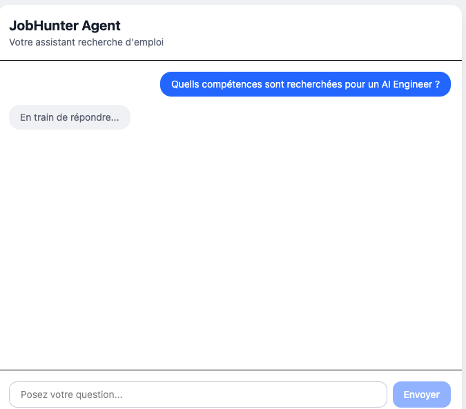
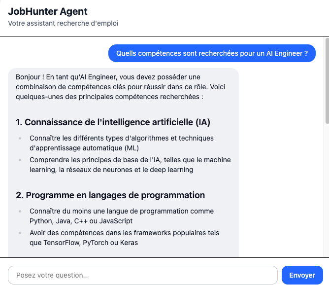

# JobHunter Agent

A learning project built to develop AI Engineer skills (Agentic systems, RAG, Generative AI) while building a practical tool for job hunting assistance.

## Project Goal

Build a full-stack AI-powered assistant that guides users through every step of their job search — from crafting a CV to preparing for interviews. The application pairs a React frontend with a Python backend powered by a LangGraph agent, running open-source LLMs locally via Ollama.

This project is designed for learning: each phase introduces new technical concepts progressively.

---

## Tech Stack

| Layer | Technology | Purpose |
|---|---|---|
| Frontend | React | Chat interface |
| Backend | FastAPI | REST API |
| LLM Router | LiteLLM | Model-agnostic LLM calls |
| LLM (local) | Ollama (Llama 3.2, Mistral…) | Local inference on Apple Silicon |
| LLM (cloud) | HuggingFace Inference API | Cloud backup / benchmarking |
| Agent Framework | LangGraph | Stateful agent graphs |
| Embeddings | sentence-transformers (HuggingFace) | Semantic search for RAG |
| Vector Store | ChromaDB | Store and retrieve embeddings |
| Database | SQLite | Persist CV data and chat history |
| Model Evaluation | Weave (W&B) | Benchmark LLM outputs against ground-truth criteria |
| Containerisation | Docker | Packaging (added in Phase 3–4) |

---

## Project Phases

### Phase 1 — Simple Chatbot (foundations)
> Skills: FastAPI, React, LiteLLM, LangGraph basics, prompt engineering

- Set up the FastAPI backend and React frontend
- Connect LiteLLM to a local Ollama model
- Build a minimal LangGraph graph (single node) to handle chat
- Create a functional chat UI focused on job hunting topics

The chat interface shows a loading state while the agent processes the request, then renders the final response as formatted markdown.

| Processing | Final response |
|---|---|
|  |  |

### Phase 2 — CV Builder Agent (memory & state) — in progress
> Skills: multi-turn conversation, structured outputs, conversation memory, SQLite, HuggingFace models

- The agent asks targeted questions to collect the user's career history
- LangGraph manages conversation state across multiple turns, including conditional routing (`route_to_generate_cv`) to decide when enough information has been collected
- Structured output (Pydantic `CVProfile`) constrains the LLM's final answer into valid JSON, which is then stored in SQLite
- A human-in-the-loop pattern lets the agent propose inferred soft skills, only keeping them if the user confirms
- Benchmark of open-source models (Llama 3.2 vs Qwen 2.5) on CV extraction accuracy using **Weave (W&B)**, comparing hallucination rate and field correctness across models
- End-to-end pipeline validated: conversation → `[CV_READY]` → structured extraction (Qwen 2.5) → SQLite persistence
- Remaining: endpoint to retrieve a saved CV, and a more robust (deterministic) guard against residual hallucination in inferred soft skills

### Phase 3 — Job Posting Analysis (RAG)
> Skills: embeddings, semantic search, ChromaDB, RAG pipeline, Docker

- User pastes a job posting → agent compares it with the stored CV
- HuggingFace `sentence-transformers` generate embeddings locally
- ChromaDB stores and retrieves vectors for semantic comparison
- Agent highlights gaps and strengths, and suggests CV improvements
- Containerise the app with Docker

### Phase 4 — Cover Letter & Benchmark (evaluation)
> Skills: prompt chaining, document generation, model evaluation

- Generate a personalised cover letter based on the CV and job posting
- Benchmark multiple LLMs (Llama, Mistral, etc.) on the same task
- Compare outputs against a reference CV to measure quality

### Phase 5 — Autonomous Web Agent & Interview Simulation (advanced agentic)
> Skills: tool use, agentic loops, web scraping, multi-agent coordination

- Agent autonomously browses job boards to find relevant postings
- Adapts the CV automatically for each opportunity
- Simulates a job interview based on the posting and the user's profile

---

## Getting Started

### Prerequisites

- Python 3.12+
- Poetry 2+
- Node.js 22+ (use nvm to manage versions)
- Ollama (`brew install ollama`)

### Install a local model

```bash
ollama serve         # start the Ollama server (keep this terminal open)
ollama pull llama3.2 # download the default model
```

### Backend setup

```bash
cd backend
poetry install
poetry run uvicorn main:app --reload
```

### Frontend setup

```bash
cd frontend
npm install
npm run dev
```

---

## Running Locally

Once everything above is installed, starting the app requires **3 terminals** running at the same time.

**Terminal 1 — Ollama (LLM server)**
```bash
ollama serve
```

**Terminal 2 — Backend (FastAPI)**
```bash
cd backend
poetry run uvicorn main:app --reload
```
Runs on [http://localhost:8000](http://localhost:8000). Check it's alive: `curl http://localhost:8000/health`.

**Terminal 3 — Frontend (React)**
```bash
cd frontend
npm run dev
```
Runs on [http://localhost:5173](http://localhost:5173) — open this URL in your browser to use the chatbot.

> Start them in this order (Ollama → backend → frontend) so each service finds its dependency already running.

---

## Project Status

- [x] Project planning and architecture design
- [x] Phase 1 — Simple Chatbot
- [ ] Phase 2 — CV Builder Agent
- [ ] Phase 3 — Job Posting Analysis (RAG)
- [ ] Phase 4 — Cover Letter & Benchmark
- [ ] Phase 5 — Autonomous Web Agent & Interview Simulation
